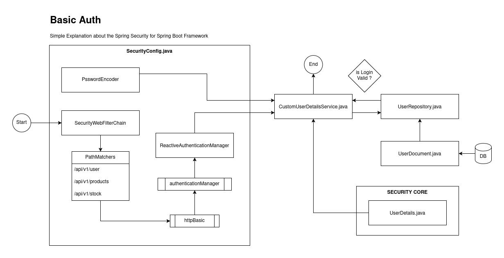

# java-spring-webflux-sample
Repository to demonstrate how to work spring webflux

## Purpose

This repository serves as a sample project to demonstrate the usage of Spring WebFlux, a reactive programming
framework for building non-blocking applications in Java.

## Contents

- Spring WebFlux
- OAuth2
- Crud Operations
    - POST
    - GET
    - PUT
    - PATCH
    - DELETE
- Spring Security
- Basic Auth
- JWT
- MongoDB
- Redis
- Docker
- Nexus
- SonarQube
- Observability
- OpenTelemetry
- Prometheus
- Grafana
- Loki
- Tempo
- Zipkin
- Jaeger
- Swagger
- OpenAPI
- JUnit
- Mockito
- Cucumber
- Circuit Breaker
- RestTemplate
- Feign
- Resilience4j
- Rate Limiting
- WebClient
- WebSocket
- Exception Handling
- Logging
- Opensearch
- Elasticsearch
- Kibana
- Kafka
- RabbitMQ
- Pagination
- Mysql
- Postgres
- H2
- Oracle Linux
- SQL Server
- AWS SQS
- AWS SNS
- AWS S3
- AWS RDS
- AWS DynamoDB
- AWS Lambda
- AWS CloudWatch
- AWS IAM
- AWS KMS
- AWS Secrets Manager
- AWS SSM Parameter Store
- AWS API Gateway
- AWS Step Functions
- AWS EventBridge

## Spring Security

### BASIC AUTH

